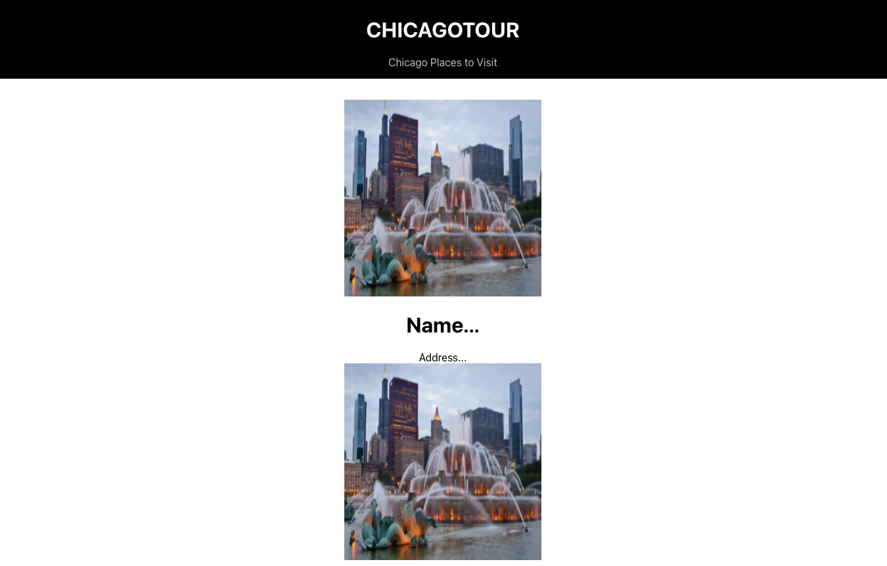

# Building-Content
Building Content for Chicago Tours project
---

Building Content

---

So far you have just been practicing with React to learn its work flow, structure, and syntax. Now you will use these ideas to put together a website.

Before making a site you should have an idea of what you are making. **The goal of this tutorial is to make a site for Chiago To See Places.**

People visiting this site could be almost anyone of almost any age. 
Let's write some for possible users of our site:

- As a user I want to find all of the places to see in Chicago
- As a user I want to find a place to see  near me
- As a user I want to view details about a place I might want to visit.

With these user stories in mind we can start building the project.

For the first user story you can build a Component that displays all of the places. Imagine this as a grid with each cell or card in the grid displaying a single PLACES with it's picture and address.

To do this, you'll need to build a couple of components.

One Component will display a PLACES location with a picture, name, address, etc. Let's call this `PLACESSpace`. This component represents a single place at an address.

The other component will display a list of places. Let's call this: `PLACESList`. This component will display a list of places.

Build the list first.

> [action]
>
> Make a new file: `src/PLACESList.js` and add the following code to it:
>
```js
// src/PLACESList.js

import React from 'react';

function PLACESList() {
  return (
    <div>
      <h1>Keep your eye on this place for future content...</h1>
    </div>
  )
}

export default PLACESList
```

Test out your list.

Import this file and use the new Component in `App.js`

> [action]
>
> Add the following to the top of `src/App.js`, then use the new Component:
>
```js
// src/App.js

import PLACESList from './PLACESList';

...

function App() {
  return (
    <div className="App">
      <Title />
      <PLACESList />
    </div>
  );
}
```

Testing your app at this point you'll see just the message: **"Keep your eye on this place..."**. This is just a place holder for the content you will add later.

React uses a Component Architecture. Notice how one component can contain another component and the App is built from many components each designed to display a single UI element.

# Creating the PLACESSpace Component

Currently the PLACESList doesn't display a list, but you'll be working on that! The goal is display a list of PLACESSpace components here, to do that you'll need to make a new Component.

For now, imagine each project has the following elements:

- Image
- Title
- Address

Let's make a component to show a project.

> [action]
>
> Make a new file: `src/PLACESSpace.js` and add the following code to it:
>
```js
// src/PLACESSpace.js
import logo from './logo.svg'

function PLACESSpace() {
  return (
    <div>
      
      <h1>Name...</h1>
      <div>Address...</div>
    </div>
  )
}

export default PLACESSpace
```

There are a few things missing here but you will revisit this shortly and pick up those details. You used the React Logo as a place holder for images that will come in the future.

For now import `PLACESSpace` into to your `PLACESList`.

> [action]
>
> In `src/PLACESList.js` add an import for `PLACESSpace.js`, then add a few Projects:
>
```js
// src/PLACESList.js
import PLACESSpace from './PLACESSpace';

...

function PLACESList() {
  return (
    <div>
      <PLACESSpace />
      <PLACESSpace />
      <PLACESSpace />
      <PLACESSpace />
    </div>
  )
}
>
...
```

Your project should now show a list of 6 PLACES places.

What's important to understand here is that you can reuse a component as often as needed. In this case you're using `PLACESSpace` six times.

Also, notice how your project is structured.

- App
    - Title
    - PLACESList
      - PLACESSpace
      - PLACESSpace
      - PLACESSpace

If you imagine your project as tree structure you can see that you have components nested within components similar to the HTML DOM.

# Add some Local Image Files

This would look a lot better with some images.

> [action]
>
> Download the images here: [SFPLACES-images](https://github.com/SkyZone-LLC/chicago-tour-images)

The code you write is not run directly. Instead the code you wrote is converted into vanilla JS and project is served from the public directory.

**Images and other static files that your project will use will often be referenced with the `public` directory as the root.**

> [action]
>
> You can do **save as** or clone repo to get images. After that, create **images** folder inside public directory of this project and put all them there.
>

Now edit `PLACESSpace.js`.

> [action]
>
```js
// src/PLACESSpace.js

...

function PLACESSpace() {
  return (
    <div>
      
      <h1>Name...</h1>
      <div>Address...</div>
    </div>
  )
}
>
...
>
```

Note! Here you set the path to an image by combing a variable and a string. This is a JavaScript expression and must be enclosed in `{...}`.

Your website should now look something similar to the following:



> [info]
>
> Static files must either be imported into a component or stored in the `public` folder. **The code you write in the `src` folder is not used directly.** It is processed and the resulting bundle is run from the `public` folder.

Take a close look at the `img` tag.

```html
...

...
```

You are putting a path together from two parts. Let's walk through how this line was derived.

When using an expression in JSX you must wrap it in `{}`.

``

We want to make a string that ends with 'images/50-california-st.jpg':

```html
``
```

The string needs to begin with the path to the public directory. React has an environment variable, `process.env.PUBLIC_URL`, that provides this. To use concatenate a variable with a string you'll use `${}` within the \``.

```html
``
```

Last, put the variable inside `${}`:

```js

```

# Making Dynamic Components with Props

Everything is working but it could still be better! All of the public places show the same name, address, and image. You want them all to be different, without having to make a new component for each.

Components take a parameter called: 'props'. Props is always an object. **Props allows you to configure components.** In this project you can use props to pass the name, address, and image into each instance of the PLACESSpace component which will allow each to display unique values.

In the case of the `PLACESSpace` Component there are three things that need to be dynamic:

- title
- image URL
- address

> [action]
>
> Start by defining `props`. Props is passed as a parameter to a component.
>
```js
// src/PLACESSpace.js
>
...
>
function PLACESSpace(props) { // Add props here!
  ...
}
```

Props is alway an object. Objects have properties you can access using the dot. For example:

- props.name
- props.image
- props.address

> [action]
>
> Add the following line to `function PLACESSpace(props)` in `src/PLACESSpace.js`:
>
```js
function PLACESSpace(props) {
  const { name, image, address } = props
  return (
    <div>
      
      <h1>{name}</h1>
      <div>{address}</div>
    </div>
  )
}
```

Testing at this point will not show anything since the values for: name, image, and address have not been defined yet. You'll define values for props where the component instance is created. This happens in `PLACESList.js`.

> [action]
>
> Edit your `PLACESList` function in `src/PLACESList.js` to the following:
>
```js
// src/PLACESList.js

...

function PLACESList() {
  return (
    <div className="PLACESList">
      <PLACESSpace
        name="Buckingham Fountain"
        address="301 S Columbus Dr, Chicago, IL 60605"
        image="buckingham-fountain.png"
      />
      <PLACESSpace />
      <PLACESSpace />
      <PLACESSpace />
      <PLACESSpace />
      <PLACESSpace />
    </div>
  )
}
...
```

The values for props are defined as attributes. The names here must match the names used within the component! Earlier you used: name, image, and address. These are the names that must be used here.

Compare the two components:


```js
// In PLACESList.js
      <PLACESSpace
        name="Buckingham Fountain"
        address="301 S Columbus Dr, Chicago, IL 60605"
        image="buckingham-fountain.png"
      />
```
```js
// In PLACESSpace.js
function PLACESSpace(props) {
  // The attributes above set the values of these properties
  const { name, image, address } = props
  ...
}
```


### Props and Components

You now have a single Component which you can use as often as needed, and each instance of the component can display a different name, image, and address, _this is the power of props_. Props are used to configure your components.

You can assign props as key value pairs defined in JSX like attributes in HTML. Props can be any value strings, numbers, objects, arrays etc. For example:

```html
<MyComp message="Hello World" value={13} data={[1,2,3]} />
```

You can access props inside a component from the `props` object which is passed as a parameter, like so:

```js
function MyComp(props) {
  <div>
    <h1>{props.message}</h1> // Hello World
    <p>{props.value}</p> // 13
  </div>
}
```

JS expression inside JSX must be placed in the `{}`. For example: `<PI value={22/7} />`

> [action]
>
> Set the props: name, image, and address for the other components in `src/PLACESList.js`. The name, and address can be anything you like for now. For image, be sure to use the file name of one of the images in the images folder.

**Attempt the challenge before viewing the solution below!** You'll gain a lot more from typing the code yourself rather than just copy/pasting. Give it a try first!


> [solution]
>
> When completed your component might look like this:
>
```js
function PLACESList() {
  return (
    <div className="PLACESList">
      <PLACESSpace
        name="Buckingham Fountain"
        address="301 S Columbus Dr, Chicago, IL 60605"
        image="buckingham-fountain.png"
      />
      <PLACESSpace
        name="Chicago Riverwalk"
        address="Chicago Riverwalk, Chicago, IL 60601"
        image="chicago-riverwalk.jpeg"
      />
      <PLACESSpace
        name="Lincoln Park Zoo"
        address="2001 N Clark St, Chicago, IL 60614"
        image="lincoln-zoo.jpeg"
      />
      <PLACESSpace
        name="Metric Coffee Co."
        address="2021 W Fulton St suite k-101b, Chicago, IL 60612"
        image="metric-coffee.jpeg"
      />
    </div>
  )
}
```

# Now Commit

>[action]
>
```bash
$ git add .
$ git commit -m 'content component built'
$ git push
```
